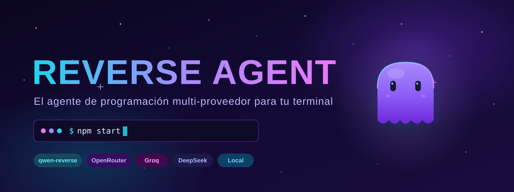
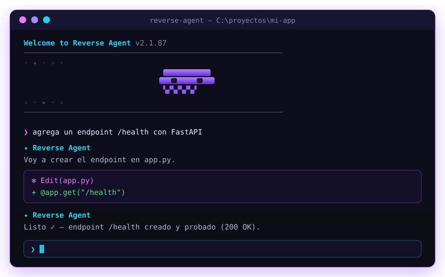
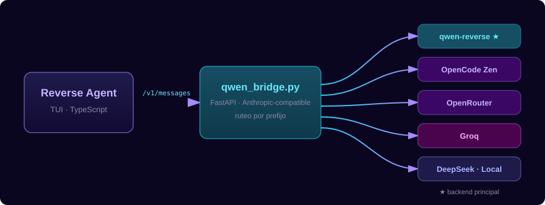
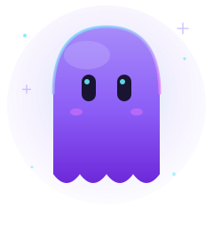

<div align="center">



<br/>

[](https://github.com/AnonymoDGH/reverse-agent/actions/workflows/ci.yml)
[](LICENSE)
[](https://github.com/AnonymoDGH/reverse-agent)
[](#proveedores)
[](#inicio-rápido)

**El agente de programación multi-proveedor para tu terminal.**
Un solo comando: instala todo, arranca el bridge y abre la TUI.

[Inicio rápido](#inicio-rápido) · [Proveedores](#proveedores) · [Uso](#uso-diario) · [Arquitectura](#arquitectura)

</div>

---

## ✨ ¿Qué es Reverse Agent?

Un agente de programación completo para la terminal con identidad propia.
Nació como una reconstrucción del CLI de Claude Code (más de 2.100 archivos en
`src/`), pero hoy es un producto distinto:

| | |
|---|---|
| 🎨 **Marca propia** | Paleta cian/violeta/fucsia y la mascota *Wisp* |
| 🔌 **Backend principal** | [`qwen-reverse`](https://pypi.org/project/qwen-reverse/) vía un puente local Anthropic-compatible |
| 🌐 **Multi-proveedor** | OpenCode Zen, OpenRouter, Groq, DeepSeek y endpoints locales (Ollama, LM Studio, vLLM) |
| 🛠️ **TUI completa** | Herramientas, permisos, MCP, memoria, hooks, plugins, sesiones, modo plan y subagentes |

<div align="center">



*La TUI de Reverse Agent: bienvenida con Wisp, edición de archivos y ejecución de herramientas.*

</div>

---

## 🚀 Inicio rápido

**Requisitos:** Node.js 20+ · Python 3.10+ *(Bun se instala solo como dependencia)*

```bash
git clone https://github.com/AnonymoDGH/reverse-agent.git
cd reverse-agent
npm start
```

`npm start` lo hace todo: instala dependencias, Bun y `qwen-reverse`, crea el
entorno Python, inicia el bridge y abre la TUI.

> 💡 Si la instalación se interrumpe, no te preocupes: el arranque detecta y
> repara automáticamente una instalación incompleta de Bun.

Consulta [`INICIO_RAPIDO.md`](INICIO_RAPIDO.md) para detalles de Windows, macOS y Linux.

### Uso diario

```bash
# Modo interactivo
npm run agent

# Una tarea y salida
npm run agent -- --print "revisa este proyecto y corrige los tests" \
  --output-format text --bare --dangerously-skip-permissions
```

---

## 🌐 Proveedores

El bridge (`qwen_bridge.py`) expone `/v1/messages` en formato Anthropic y rutea
cada request al proveedor según el **prefijo del modelo**:

| Prefijo | Proveedor | Activación |
| :--- | :--- | :--- |
| *(ninguno)* | ⭐ **qwen-reverse** (principal) | siempre activo |
| `opencode/` | OpenCode Zen | `ZEN_API_KEY` (o key local de opencode) |
| `openrouter/` | OpenRouter | `OPENROUTER_API_KEY` |
| `groq/` | Groq | `GROQ_API_KEY` |
| `deepseek/` | DeepSeek | `DEEPSEEK_API_KEY` |
| `local/` | OpenAI-compatible | `OPENAI_COMPATIBLE_BASE_URL` (Ollama, etc.) |

<details>
<summary><b>📋 Ejemplos por proveedor</b></summary>

```bash
# Qwen (por defecto)
QWEN_MODEL=qwen3.8-max npm run agent

# OpenRouter
OPENROUTER_API_KEY=sk-or-... QWEN_MODEL=openrouter/anthropic/claude-sonnet-4.5 npm run agent

# Groq
GROQ_API_KEY=gsk_... QWEN_MODEL=groq/llama-3.3-70b-versatile npm run agent

# DeepSeek
DEEPSEEK_API_KEY=sk-... QWEN_MODEL=deepseek/deepseek-reasoner npm run agent

# Ollama local
OPENAI_COMPATIBLE_BASE_URL=http://localhost:11434/v1 QWEN_MODEL=local/llama3.1 npm run agent
```

</details>

Dentro de la TUI:

- `/model` — cambia de modelo; el picker lista Qwen y los proveedores configurados
- `/providers` — estado de cada proveedor (activo, prefijo y modelos destacados)

Cualquier modelo sin prefijo que no sea Qwen se envía al primer proveedor
configurado; si no hay ninguno, se usa qwen-reverse.

---

## 🏗️ Arquitectura

<div align="center">



</div>

```
CLI TypeScript (Bun) ──/v1/messages──▶ qwen_bridge.py (FastAPI) ──▶ proveedor
```

---

## ⚙️ Configuración

```env
QWEN_REVERSE=1
QWEN_REVERSE_BASE_URL=http://127.0.0.1:8090
QWEN_MODEL=qwen3.8-max-thinking
QWEN_TOKEN=
```

`QWEN_TOKEN` es opcional; `qwen-reverse` admite funcionamiento anónimo.
El resto de variables de proveedores está en [`.env.example`](.env.example).

---

## 🧪 Compilación y pruebas

```bash
npm run build        # genera dist/entry.js + sourcemap
npm run test:bridge  # 30 tests del puente Python
npm run test:local   # checks de integración local
```

Flujo completo verificado: CLI TypeScript → puente Anthropic → proveedor →
llamada de herramienta → escritura local → respuesta final.

---

## 🎨 Identidad visual

<div align="center">



</div>

- **Paleta de marca:** cian `#22d3ee` + violeta `#a78bfa` + fucsia `#e879f9`
- **Mascota:** *Wisp*, un fantasma del espacio profundo que viaja "al revés" por tu código
- **Seis temas:** dark, light, dark/light daltonizados y dark/light ANSI

---

## ⚠️ Aviso

`qwen-reverse` utiliza endpoints web no oficiales de Qwen. Puede dejar de
funcionar si el servicio cambia y puede estar sujeto a límites o bloqueos.
Úsalo conforme a los términos aplicables. Los proveedores de API requieren sus
propias claves y términos.

---

<div align="center">

Hecho con 💜 · [Licencia MIT](LICENSE)

</div>
